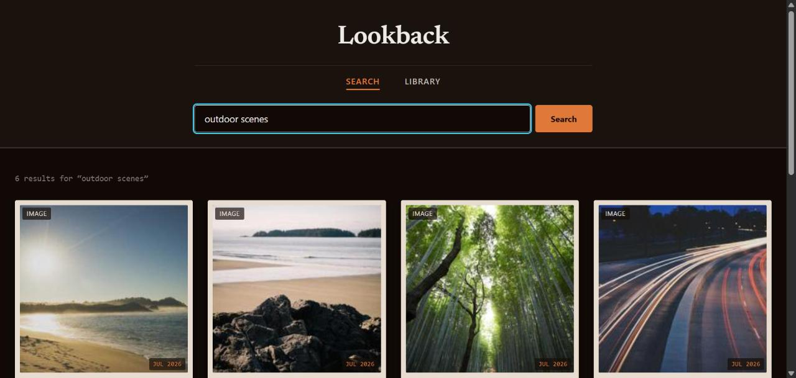

# Lookback

Lookback looks at every photo and video on your drive, writes a quick description of what's in it, and lets you search those descriptions instead of digging through folders. Type "birthday parties" or "that hike we did in the fall" and it finds them.

It all runs on your own machine (or your own home network). Nothing gets uploaded, and no cloud AI service ever sees your files.



> **Windows only.** The setup/launch scripts and the "open file" feature are Windows-specific.

## How it works

1. **Indexing** — the app walks a folder you choose and asks a local vision model ([Ollama](https://ollama.com)) to describe each photo/video.
2. Those descriptions are turned into embeddings and stored in [Qdrant](https://qdrant.tech), a small local vector database.
3. **Searching** — your query is expanded into related terms, embedded the same way, and matched against everything indexed, so "things from the beach" can match a caption saying "sand, waves, sunset" even if you never typed those words.
4. Results show up as thumbnails with captions and a relevance score, right in your browser.

Nothing calls out to the internet during search or indexing.

## Requirements

- **Python 3.11+**
- **[Ollama](https://ollama.com/download)** — runs the AI models, on this computer or another one on your network
- **ffmpeg** — `winget install ffmpeg`
- **Git** (or just download the ZIP)

Docker and a separate database install are **not** required — Qdrant runs embedded, in-process.

## Quick start

1. Clone the repo:
   ```
   git clone <this-repo-url>
   cd img-searcher
   ```
2. Pull the models Ollama will use:
   ```
   ollama pull moondream
   ollama pull nomic-embed-text
   ollama pull llama3.2
   ```
3. Run `run_all.bat`. The first time, it installs dependencies, walks you through a short setup wizard (which folder to index, where Ollama is running), and opens `http://localhost:8000`.
4. In the browser, go to **Index Status** and click **Index new files**. This is the slow part — it's resumable, so you can close and come back later.
5. Switch to **Search** and type what you're looking for.

Every run after the first just starts the app — setup only happens once.

## Choosing models for your hardware

The defaults (`moondream`, `nomic-embed-text`, `llama3.2`) run comfortably on ~8GB RAM. With more RAM/VRAM, upgrading the **vision model** (e.g. to `llava:7b` or `llava:13b`) matters most — it drives caption quality, which is what actually gets searched. Swap models by pulling the new one, updating `VISION_MODEL`/`QUERY_MODEL` in `.env`, and restarting — no need to re-run setup.

## Running Ollama on a separate machine

If your main computer is short on RAM, run Ollama on another machine on your network and point this app at it over SSH — the setup wizard handles this if you answer "another computer." Set up passwordless SSH first (`ssh-keygen` + `ssh-copy-id`); see `start_tunnel.bat` for exact commands.

## Configuration (`.env`)

`setup.py` writes this for you; hand-edit and restart the app anytime. See `.env.example` for the full template.

| Variable | What it controls |
|---|---|
| `HOST` / `PORT` | Where the web server listens (default `127.0.0.1:8000` — this machine only) |
| `SSD_PATH` | The folder that gets indexed |
| `OLLAMA_URL`, `OLLAMA_REMOTE` | Where Ollama is, and whether it's remote (SSH tunnel) |
| `VISION_MODEL`, `EMBED_MODEL`, `QUERY_MODEL` | Which Ollama models to use |
| `QDRANT_MODE` | `embedded` (default) or `server` (a separate Qdrant instance, e.g. via `docker-compose.yml`) |

## Running the tests

The project has a small pytest suite covering the security-sensitive and correctness-critical parts of the code (path-traversal protection, file dedup hashing):

```
pip install -r requirements-dev.txt
pytest tests/
```

A GitHub Actions workflow (`.github/workflows/tests.yml`) runs this suite automatically on every push.

## Troubleshooting

- **"Cannot reach Ollama"** — make sure `ollama serve` is running (or check your SSH tunnel if remote).
- **Indexing is slow** — expected for large libraries; captioning is the bottleneck. Try a lighter vision model if needed.
- **A file shows "failed" status** — it's retried automatically on the next indexing run.
- **Search returns nothing** — check Index Status to confirm files have actually been indexed.

## Privacy

Search queries and image descriptions can include sensitive content — models, captions, and the database all stay on hardware you control. Nothing is sent to any third-party service.

## Project structure

```
img-searcher/
├── main.py              # FastAPI app -- serves the UI and search API
├── indexer.py           # Scans your folder, captions files, stores them in Qdrant
├── setup.py             # First-run interactive setup wizard
├── config.py            # Loads all settings from .env
├── qdrant_db.py         # Chooses embedded vs. server Qdrant connection
├── run_all.bat          # One script to bootstrap and start everything
├── start_tunnel.bat     # SSH tunnel helper, only used with a remote Ollama
├── static/index.html    # The search UI (single file, no build step)
├── static/tokens.css    # Design tokens (colors, spacing, type) for the UI
├── tests/                # Pytest suite
├── .github/workflows/    # CI (runs tests on every push)
├── .env.example          # Template for your own .env
└── docker-compose.yml    # Optional: only needed for QDRANT_MODE=server
```

## License

MIT — see [LICENSE](LICENSE).
